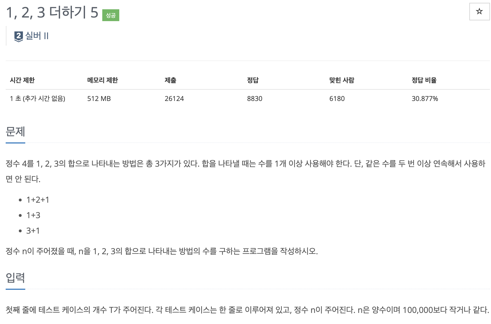
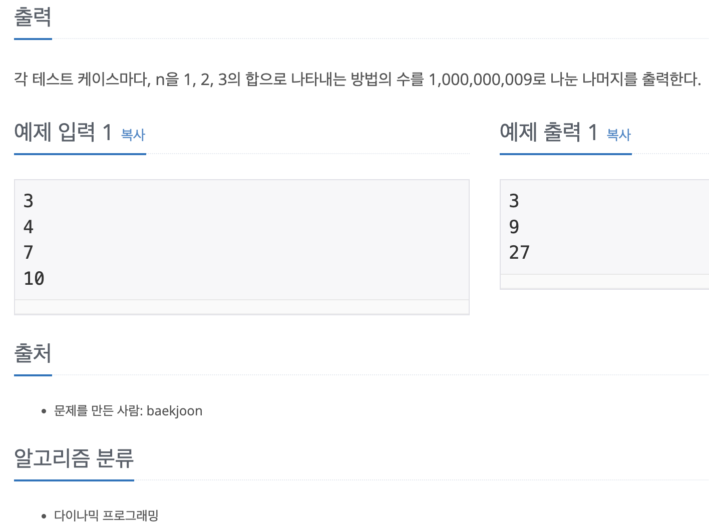

## :pushpin: 문제링크

<https://www.acmicpc.net/problem/15990>





## :pushpin:풀이과정


각 수를 만드는 경우의 수중 마지막에 더하는 수는 무조건 1, 2, 3중 하나이다.

따라서 dp테이블을  2차원 배열로 만들어준다.

마지막에도 모듈러 연산을 해주는것이 중요하다.


## :pushpin:코드


```c++
#include <bits/stdc++.h>
#define MOD 1000000009
using namespace std;
int T, n;
long long dp[100001][4];

void init(){
    dp[1][1] = 1;
    dp[2][2] = 1;
    dp[3][1] = 1;
    dp[3][2] = 1;
    dp[3][3] = 1;
    for(int i = 4; i <= 100001; i++){
        dp[i][1] = (dp[i - 1][2] + dp[i - 1][3]) % MOD;
        dp[i][2] = (dp[i - 2][1] + dp[i - 2][3]) % MOD;
        dp[i][3] = (dp[i - 3][1] + dp[i - 3][2]) % MOD;
    }
}

void solve(){
    cin >> T;
    while(T--){
        cin >> n;
        cout << ((dp[n][1] + dp[n][2] + dp[n][3]) % MOD) << "\n";
    }
}

int main(){
    ios::sync_with_stdio(0);
    cin.tie(0);
    cout.tie(0);
    init();
    solve();
    return 0;
}
```